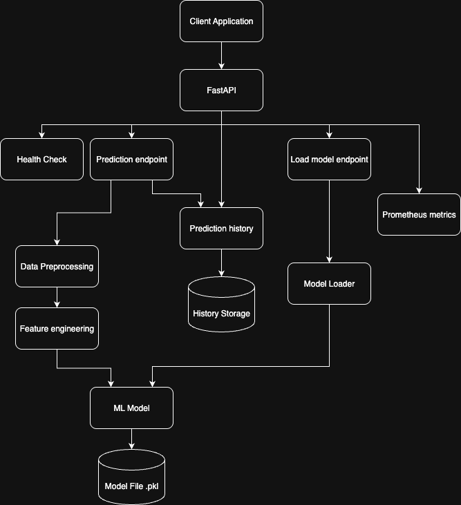

# Titanic API Architecture Diagram

## System Overview

## Key Features Summary

### 🚀 **Core Features**
- **RESTful API**: FastAPI-based endpoints for predictions
- **ML Integration**: Model loading and prediction
- **Data Preprocessing**: Feature engineering pipeline

### 📊 **Monitoring & Observability**
- **Prometheus Metrics**: Request counters, error tracking, history gauge
- **Structured Logging**: JSON format with request tracking
- **Health Check**: Model status and API health monitoring

### 🧪 **Testing & Quality**
- **Code Coverage**: Comprehensive unit and integration tests
- **End-to-End Testing**: Complete workflow validation

### 🛠️ **Development & Deployment**
- **Docker Support**: Containerized deployment
- **Virtual Environment**: Isolated Python environment
- **Modular Structure**: Clean separation of concerns

### 📈 **Scalability Features**
- **Model Hot-Swapping**: Dynamic model loading
- **History Management**: Prediction tracking and retrieval
- **Error Handling**: Robust error management
- **Performance Monitoring**: Real-time metrics collection

This architecture provides a production-ready, scalable, and maintainable solution for the Titanic survival prediction API with comprehensive testing, monitoring, and deployment capabilities. 